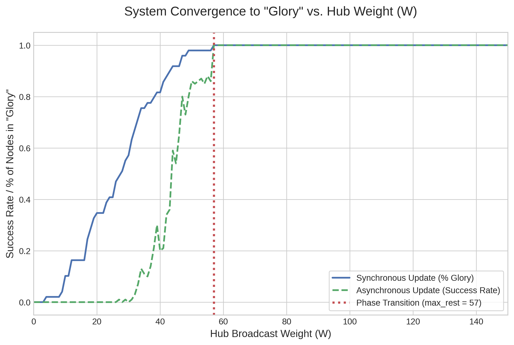

# Heaven & Hell

Formal model + simulation of a binary-state update system on a weighted digraph with a single “hub”. We ask:

> When can one hub force **everyone** to the target state in **one round**, no matter the start?

All main statements are mechanized in Coq (no axioms). A small C++ simulator and Python plot reproduce the sharp phase transition theorems predict.

------

## Core result (one-round iff)

Let $V$ be finite, $g\in V$ a hub, $w:V\times V\to\mathbb{N}$ the influence weights. For $v\neq g$,

$$
\text{hub}(v)=w(g\!\to\! v),\qquad \text{rest}(v)=\sum_{u\neq g} w(u\!\to\! v).
$$

With ties breaking toward the target state, all nodes flip to `Glory` in one synchronous step from any start state iff

$$
\forall v\neq g:\quad \text{hub}(v)\ \ge\ \text{rest}(v).
$$

This is a tight, local condition, an exact “one-round” characterization, not just a sufficient bound.

**File:** `RulesHeavenHell.v` (theorem: `heaven_one_step_all_G_iff_domination_ge`)

------

## Useful corollaries (one-liners)

- **Uniform hub budget.** If $w(g\!\to\! v)\equiv W$ for all $v\neq g$, then

$$
W_\star=\max_{v\neq g}\text{rest}(v),\qquad
    \text{one round}\iff W\ge W_\star.
$$

  Sharpness: if $W, there is a specific non-hub that does **not** flip in one round from the all-`Gnash` state.
   (`uniform_hub_one_step_iff`, `uniform_hub_below_threshold_counterexample`)

- **Tie bias $\tau$.** If decisions compare $\mathrm{SG}+\tau(v)$ vs $\mathrm{SN}$,

$$
\forall v\neq g:\quad \text{hub}(v)+\tau(v)\ \ge\ \text{rest}(v),
$$

  and under a uniform hub $W$: $W\ge \max_{v\neq g}(\text{rest}(v)-\tau(v))_+$.
   (`heaven_one_step_all_G_iff_domination_ge_tau`, `uniform_hub_tau_one_step_iff`)

- **Seeding trade-off.** If a set $S\subseteq V\setminus\{g\}$ is pre-set to `Glory`,

$$ \text{hub}(v) + w(S\to v) \ge \text{rest}\\_\text{outside}_S(v) \implies v \text{flips in one round after seeding} $$

  (with $\tau$: add $+\tau(v)$ on the LHS).
   (`two_step_sufficient`, `two_step_sufficient_tau`)

- **Asynchronous one-pass.** If the one-round condition holds, any schedule touching each non-hub once yields `Glory` after that pass.
   (`async_one_pass_all_G_nonhub`)

------

## Why this matters

- **Exact deploy budgets.** The inequalities are *local per node* yet guarantee a *global one-round* outcome.
- **Actionable knobs.** Uniform budget $W$, tie bias $\tau$, and seeding $S$ give clean trade-offs.
- **Robustness.** The asynchronous guarantee works without a global barrier.
- **Mechanized assurance.** Coq proofs prevent edge-case mistakes (ties, hub masking, schedule quirks).

------

## Repo layout

```
.
├── RulesHeavenHell.v      # Coq model + proofs (generic + examples)
├── src/
│   ├── main.cpp           # Random-graph simulator (sweeps W)
│   └── Makefile
├── plot_results.py        # Plot CSV -> phase transition curve
├── results.csv            # Example output
├── heaven_hell_plot.png   # Example figure
└── README.md
```

------

## Build & reproduce

### 1) Proofs (Coq)

- Requires Coq ≥ 8.16 with stdlib.

```bash
coqc RulesHeavenHell.v
```

### 2) Simulation (C++)

```bash
make -C src
./src/heaven_hell_sim > results.csv
```

This sweeps the uniform hub weight $W$ and records outcomes; the observed “flip point” matches $W_\star=\max_{v\neq g}\text{rest}(v)$.

### 3) Plot

```bash
uv venv
uv pip install pandas matplotlib
.venv/bin/python plot_results.py
```

Outputs `heaven_hell_plot.png` showing the phase transition at $W_\star$.


This produces the following plot:  $\text{max}_{\text{rest}}$ is the maximum $\text{rest}_{\text{weight}}$ found in the random graph. As predicted, the system reliably converges to `Glory` precisely when $W$ exceeds this value. 




------

## Using the results in other tools

- **Static checks:** Compute $\text{rest}(v)$ per service from your topology; enforce $\text{hub}(v)\ge\text{rest}(v)$ in config validation.
- **Budgeting:** If you enforce a uniform hub budget $W$, set $W\ge\max_v\text{rest}(v)$ (or use $(\text{rest}(v)-\tau(v))_+$ if you implement a bias).
- **Warm starts:** Pick seed set $S$ so that $\text{hub}(v)+w(S\!\to\! v)$ clears the residual $\text{rest\\_outside}_S(v)$.

------

## License

MIT. See `LICENSE`.

------

## Notes

- No preprint yet; if you reference this work, please link to the repository.
- All results are proved with Coq’s standard library only (`List`, `Lia`, `Arith`, `PeanoNat`, `Bool`).
